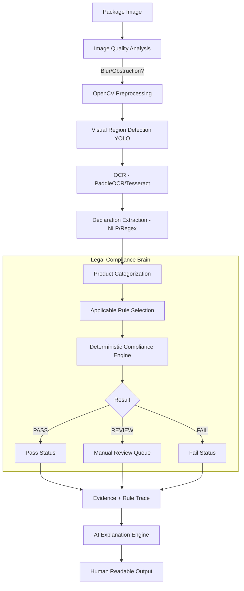

# AI Pipeline Architecture

The primary tenet of the MetronIQ AI pipeline is that **AI assists, extracts, and explains, but the deterministic rule engine makes the final legal decision.**

## Pipeline Diagram

## Step-by-step
1. **Input:** Operator uploads or takes a photo of the package.
2. **Quality & Preprocessing:** Basic computer vision (blur detection, lighting checks) ensures the image is parseable.
3. **Region Detection & OCR:** Object detection identifies label areas, and OCR pulls text data out.
4. **Extraction:** Structured fields (MRP, quantity, dates, manufacturer) are mapped and extracted with confidence scores.
5. **Brain Execution:** The engine matches extracted concepts against active versions of legal rules.
6. **Output & Explanation:** The system outputs PASS/REVIEW/FAIL and feeds the verifiable rule trace to an LLM to generate a human-readable explanation (e.g. "Net Quantity of 100g does not meet the 2mm font height requirement for this package size").
