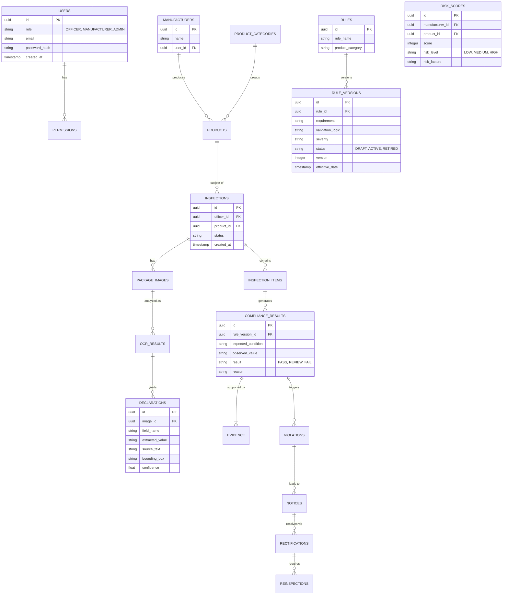

# Database Architecture

The PostgreSQL schema ensures strict traceability, version control for rules, and separated hierarchies for users and findings.

## Entity Relationship Diagram

## Traceability Principles
- Nothing is physically deleted; statuses are toggled (soft delete).
- `RULE_VERSIONS` allows a `COMPLIANCE_RESULT` to clearly identify exactly what logic evaluated it at that specific moment in time.
- Evidence references explicit declaration IDs, bounding boxes, and images.
