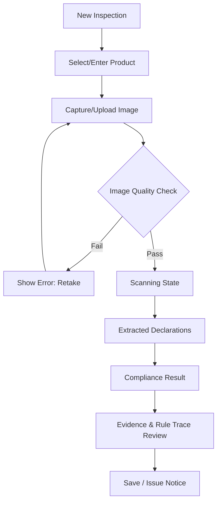

# New Inspection Flow (Web)

## Scanner State UI
Uses a progress stepper without fake animations:
- [x] Analyzing Image
- [x] Text Detection
- [ ] Declaration Extraction (spinner)
- [ ] Rule Evaluation
- [ ] Result
